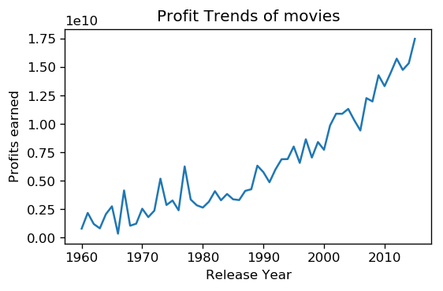
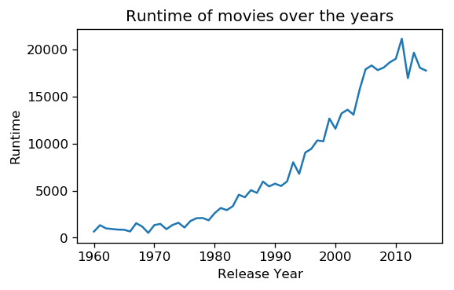
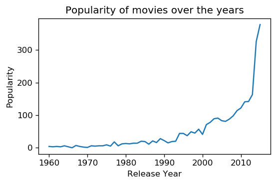
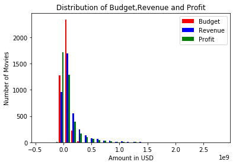

# Project: Investigate TMDB movies Dataset 

## Table of Contents
<ul>
<li><a href="#intro">Introduction</a></li>
<li><a href="#wrangling">Data Wrangling</a></li>
<li><a href="#eda">Exploratory Data Analysis</a></li>
<li><a href="#conclusions">Conclusions</a></li>
</ul>

# <a id='intro'></a>
## Introduction

> TMDB movie data set is used to investigate and analyze data.It contains information about 10,000 movies collected from The Movie Database (TMDb), including user ratings and revenue.

> Using this Data set we can analyze below questions :

>  1.Profit Trends of movies over the years

>  2.Movies with Popular runtime over the time

>  3.Popularity Trend of movies

>  4.Budget,Revenue and profit distribution.
  
  
  
  
  

#### Importing packages used for analysing and plotting data


```python
# Use this cell to set up import statements for all of the packages that you
#   plan to use.

# Remember to include a 'magic word' so that your visualizations are plotted
#   inline with the notebook. See this page for more:
#   http://ipython.readthedocs.io/en/stable/interactive/magics.html
import pandas as pd
import numpy as np
import csv
from datetime import datetime
import matplotlib.pyplot as plt
% matplotlib inline

```

#### <a id='wrangling'></a>
## Data Wrangling


### General Properties

Observations:

There are total 21 columns in the given data set. There are 10866 rows.

Null values are present in below columns: 
 
 imdb_id , cast , homepage , director , tagline , keywords , overview , genres , production_companies
 
For further analysing of data need to drop unused columns, drop duplicate rows and rows with null values for genres since it is used for answering some of the above questions.Calculate profit column and remove rows with 0 profit


 Loading csv file and displaying information about data set


```python
# Load your data and print out a few lines. Perform operations to inspect data
#   types and look for instances of missing or possibly errant data.
df = pd.read_csv('tmdb-movies.csv')
df.info()

```

    <class 'pandas.core.frame.DataFrame'>
    RangeIndex: 10866 entries, 0 to 10865
    Data columns (total 21 columns):
    id                      10866 non-null int64
    imdb_id                 10856 non-null object
    popularity              10866 non-null float64
    budget                  10866 non-null int64
    revenue                 10866 non-null int64
    original_title          10866 non-null object
    cast                    10790 non-null object
    homepage                2936 non-null object
    director                10822 non-null object
    tagline                 8042 non-null object
    keywords                9373 non-null object
    overview                10862 non-null object
    runtime                 10866 non-null int64
    genres                  10843 non-null object
    production_companies    9836 non-null object
    release_date            10866 non-null object
    vote_count              10866 non-null int64
    vote_average            10866 non-null float64
    release_year            10866 non-null int64
    budget_adj              10866 non-null float64
    revenue_adj             10866 non-null float64
    dtypes: float64(4), int64(6), object(11)
    memory usage: 1.7+ MB


### Data Cleaning 

In this section we're going to sift through data . Remove unused columns,Remove duplicate rows and remove rows with invalid values to make a cleaner data set for analysis.


Printing rows and columns in data set


```python
print('Total rows and coulmns before data cleaning',df.shape)
```

    Total rows and coulmns before data cleaning (10866, 21)


Deleting Unused columns


```python
df.drop(['id','imdb_id','budget','revenue','cast','homepage','director','tagline','keywords','overview','production_companies','release_date','vote_count','vote_average'], axis=1, inplace=True)
```

Removing duplicate records


```python
df.drop_duplicates(inplace=True)
```

Removing rows which has 'genres' value empty


```python
df.dropna(subset=['genres'], inplace=True)  
```

Replace data which has 0 with NaN and Removing rows which has NaN for value in any column/row


```python
df=df.replace(0,np.NaN)
df=df.dropna()
```

converting popularity ,runtime , budget and revenue to int type


```python
df[['popularity','runtime','budget_adj', 'revenue_adj']] = df[['popularity','runtime','budget_adj', 'revenue_adj']].applymap(np.int64)

```

calculating and Adding profit column using budget_adj and revenune_adj columns and providing index of newly added column. Assuming currency in US dollars(USD/$)


```python
df.insert(7,'profit',df['revenue_adj']-df['budget_adj'])
```

Printing information about filtered data


```python
print('Total rows and coulmns after data cleaning',df.shape)
df.info()
```

    Total rows and coulmns after data cleaning (3854, 8)
    <class 'pandas.core.frame.DataFrame'>
    Int64Index: 3854 entries, 0 to 10848
    Data columns (total 8 columns):
    popularity        3854 non-null int64
    original_title    3854 non-null object
    runtime           3854 non-null int64
    genres            3854 non-null object
    release_year      3854 non-null int64
    budget_adj        3854 non-null int64
    revenue_adj       3854 non-null int64
    profit            3854 non-null int64
    dtypes: int64(6), object(2)
    memory usage: 271.0+ KB


save new clean dataset to a csv file


```python
df.to_csv('clean_tmdb_data.csv', index=False)
```

<a id='eda'></a>
## Exploratory Data Analysis


### Research Question 1 Profit Trends of movies over the years

### Observations: 
Maximum profit was in the year 2015 and Minimum profit was in the year 1966. profits are increasing from year 1980 

Writing a function definition to find trend. It takes 5 parameters as inputs, which are used to calculate graph by getting data from clean dataset csv file which was created in previous section.Parameters are column to be shown on x-axis,column to be shown on y-axis. This function will return Maximum and Minumum value for given y_axis over x_axis


```python

def find_trend(column_x,column_y):
    #load clean data
    df = pd.read_csv('clean_tmdb_data.csv')
    #set graph size
    plt.figure(figsize=(5,3), dpi = 120)
    #plotting the graph
    plt.plot(df.groupby(column_x)[column_y].sum())
    df.groupby(column_x)[column_y].sum().describe()
    max_value = df.groupby(column_x)[column_y].sum().idxmax()
    min_value = df.groupby(column_x)[column_y].sum().idxmin()
    return max_value,min_value,plt
```

Labeling the graph : x-axis,y-axis and Title. Calling function find_trend with parameters release_year and profit to show graph and max/min values for profit over the years


```python
maxval,minval,plt=find_trend('release_year','profit')
#x-axis label
plt.xlabel('Release Year', fontsize = 10)
#y-axis label
plt.ylabel('Profits earned', fontsize = 10)
#title of the graph
plt.title('Profit Trends of movies')
plt.show()
print('Maximum profitable year',maxval)
print('Minimum profitable year',minval)
```





    Maximum profitable year 2015
    Minimum profitable year 1966


### Research Question 2 Movies with Popular runtime over the time

### Observations: 
maximum runtime was in year 2011 and minimum runtime was in year 1969. runtime is consistently increasing over years till 2014 and after that there is a steady decline in runtime

Labeling the graph : x-axis,y-axis and Title . calling function find_trend with parameters release_year and runtime to show graph and max/min values for runtime over the years


```python
maxval,minval,plt=find_trend('release_year','runtime')
#x-axis label
plt.xlabel('Release Year', fontsize = 10)
#y-axis label
plt.ylabel('Runtime', fontsize = 10)
#title of the graph
plt.title('Runtime of movies over the years')
plt.show()
print('Maximum runtime year',maxval)
print('Minimum runtime year',minval)
```





    Maximum runtime year 2011
    Minimum runtime year 1969


### Research Question 3 Popularity Trend of movies

### Observations :

Movies were most popular in year 2015 and least popular in year 1966. Popularity of movies is consistently increasing over years

Labeling the graph : x-axis,y-axis and Title . calling function find_trend with parameters release_year and popularity to show graph and max/min values for popularity over the years


```python
maxval,minval,plt=find_trend('release_year','popularity')
#x-axis label
plt.xlabel('Release Year', fontsize = 10)
#y-axis label
plt.ylabel('Popularity', fontsize = 10)
#title of the graph
plt.title('Popularity of movies over the years')
plt.show()
print('Most Popular year for movies',maxval)
print('Least Popular year for movies',minval)
```





    Most Popular year for movies 2015
    Least Popular year for movies 1966


### Research Question 4 Budget,Revenue and profit Distribution

### Observations:
There are very few high budget movies. Revenue and profit are proportional. There is no direct relation between budget and revenue. some of the low budget movies have shown more profit than revenue. This may be due to inaccurate data.


Loading clean dataset which was created from original dataset


```python
df = pd.read_csv('clean_tmdb_data.csv')
```

Setting figure size


```python
figure = plt.figure(figsize=(10,6),dpi=120)
```


    <matplotlib.figure.Figure at 0x10c980048>


Plotting histogram for budget_adj,revenue_adj and profit using different colors to differentiate them. Assigning labels to colors


```python
plt.hist([
        df['budget_adj'],df['revenue_adj'],df['profit']
        ], 
         stacked=False, color = ['r','b','g'],
         bins = 30,label = ['Budget','Revenue', 'Profit'])
###Labeling the graph : x-axis,y-axis and Title
plt.xlabel('Amount in USD')
plt.ylabel('Number of Movies')
plt.title('Distribution of Budget,Revenue and Profit')
### Adding legend 
plt.legend()
```


    <matplotlib.legend.Legend at 0x10c2392e8>





<a id='conclusions'></a>
## Conclusions

In this Investigation we are able to find most profitable and least profitable years.Also about maximu/minimum runtime and most/least popular year for movies. 

Some of the other information we can find is average profits are increasing in last few years and runtime is decresing from past few years. However to determine relation between increase in profits and decrease in runtime over years need to be analysed further.Also popularity for movies is consistenly increasing. This may be due to increase in modes of advertisement and internet connectivity to more people. 

There are some limitations. Above observations may not be accurate, as statistical methods are not used to infer information and only basic visualizations are used. Further analysis is required to produce accurate information. some rows are deleted from data set due to non existent values , this may effect the analysis and USD is considered as common currency for columns reveneu_adj and budget_adj. This may effect the profit trend of movies over the years.


```python
from subprocess import call
call(['python', '-m', 'nbconvert', 'Investigate_a_Dataset.ipynb'])
```


    0


